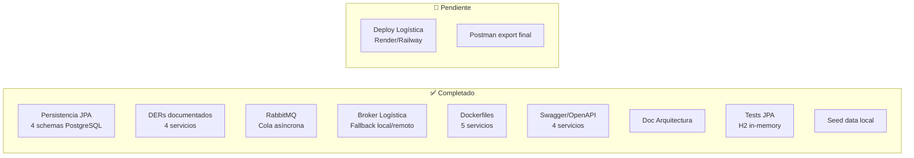

# Relevamiento General — DonaTrack Entrega 4

## Checklist de Entregables (Entrega 4)

| # | Entregable | Estado | Observaciones |
|---|------------|--------|---------------|
| 1 | Modelo de Clases actualizado por servicio | ✅ Hecho | [`DonaTrack-Diagrama-Clases-Entrega4.puml`](file:///home/mateo/Desktop/DonaTrack/diagramas/DonaTrack-Diagrama-Clases-Entrega4.puml) — con `@Entity` marcados |
| 2 | DER físico por servicio | ✅ Hecho | 4 DERs: [Donaciones](file:///home/mateo/Desktop/DonaTrack/diagramas/donaciones/DER-Donaciones.puml), [Logística](file:///home/mateo/Desktop/DonaTrack/diagramas/logistica/DER-Logistica.puml), [Incentivos](file:///home/mateo/Desktop/DonaTrack/diagramas/incentivos/DER-Incentivos.puml), [Notificaciones](file:///home/mateo/Desktop/DonaTrack/diagramas/notificaciones/DER-Notificaciones.puml) |
| 3 | Justificaciones de Diseño + Diagramas complementarios | ✅ Hecho | Diagramas de secuencia, estados, componentes disponibles en `diagramas/` |
| 4 | Diagrama de Componentes actualizado (con integración) | ✅ Hecho | [`DonaTrack-Diagrama-Componentes-y-Despliegue-Entrega4.puml`](file:///home/mateo/Desktop/DonaTrack/diagramas/DonaTrack-Diagrama-Componentes-y-Despliegue-Entrega4.puml) |
| 5 | Documento de Arquitectura (patrones, capas, justificaciones) | ✅ Hecho | [`docs/arquitectura.md`](file:///home/mateo/Desktop/DonaTrack/docs/arquitectura.md) — SOA + Hexagonal + Broker + RabbitMQ |
| 6 | Implementación de requerimientos de integración | ✅ Hecho | Ver detalle abajo |
| 7 | Despliegue de servicio de logística | 🔴 Pendiente | Falta deploy en Render/Railway. Dockerfile existe. |

---

## Validación de Requerimientos de Integración

### Cola de mensajes para notificaciones ✅
- **Donaciones → Notificaciones**: `DonacionesRabbitMQAdapter` publica eventos en `donaciones.exchange` con routing keys: `notificacion.inicio.ruta`, `notificacion.entrega.exitosa`, `notificacion.entrega.fallida`, `donacion.replanificada`
- **Incentivos → Notificaciones**: `IncentivosNotificacionAdapter` publica en `incentivos.exchange`
- **Notificaciones consume**: Listeners con `@RabbitListener` y `@QueueBinding` explícitos
- La comunicación es 100% asíncrona ✅

### Broker de Integración con Logística ✅
- [`LogisticaBrokerAdapter`](file:///home/mateo/Desktop/DonaTrack/donatrack-donaciones/src/main/java/com/donatrack/donaciones/infrastructure/adapters/out/client/logistica/LogisticaBrokerAdapter.java) implementa `LogisticaPort`
- Patrón fallback: intenta remoto (Feign) → si falla → local (localhost:8002)
- Cumple: "permitir seleccionar entre más de 1 servicio de logística disponible" ✅

### Despliegue de logística 🔴
- Dockerfile existe en [`donatrack-logistica/Dockerfile`](file:///home/mateo/Desktop/DonaTrack/donatrack-logistica/Dockerfile)
- Falta desplegar a Render/Railway con la BD Supabase
- El perfil `prod` ya está configurado con Supabase credentials

---

## Fidelidad DER ↔ Entidades JPA ↔ init.sql

### Donaciones ✅
| DER | Entity JPA | Tabla SQL | Match |
|-----|-----------|-----------|-------|
| Direccion | `DireccionEntity` | `donaciones.direcciones` | ✅ |
| Persona (JOINED) | `PersonaEntity` (abstract) | `donaciones.personas` | ✅ |
| PersonaHumana | `PersonaHumanaEntity` | `donaciones.personas_humanas` | ✅ |
| PersonaJuridica | `PersonaJuridicaEntity` | `donaciones.personas_juridicas` | ✅ |
| Rol (JOINED) | `RolEntity` (abstract) | `donaciones.roles` | ✅ |
| RolDonante | `DonanteEntity` | `donaciones.roles_donante` | ✅ |
| RolRepresentante | `RepresentanteEntity` | `donaciones.roles_representante` | ✅ |
| RolBeneficiario | `BeneficiarioEntity` | `donaciones.roles_beneficiario` | ✅ |
| Categoria | `CategoriaEntity` | `donaciones.categorias` | ✅ |
| Subcategoria | `SubcategoriaEntity` | `donaciones.subcategorias` | ✅ |
| DonacionOriginal | `DonacionOriginalEntity` | `donaciones.donaciones_originales` | ✅ |
| Donacion | `DonacionEntity` | `donaciones.donaciones` | ✅ |
| Bien | `BienEntity` | `donaciones.bienes` | ✅ |
| Foto | `FotoEntity` | `donaciones.fotos` | ✅ |
| HistorialEstado | `HistorialEstadoEntity` | `donaciones.historial_estado` | ✅ |
| Necesidad (SINGLE_TABLE) | `NecesidadEntity` | `donaciones.necesidades` | ✅ |
| PeriodoNecesidad | `PeriodoNecesidadEntity` | `donaciones.periodos_necesidad` | ✅ |

### Logística ✅
| DER | Entity JPA | Tabla SQL | Match |
|-----|-----------|-----------|-------|
| Camion | `CamionEntity` | `logistica.camiones` | ✅ |
| Chofer | `ChoferEntity` | `logistica.choferes` | ✅ |
| SolicitudPlanificacion | `SolicitudPlanificacionEntity` | `logistica.solicitudes_planificacion` | ✅ |
| RutaReparto | `RutaDeRepartoEntity` | `logistica.rutas_reparto` | ✅ |
| Parada | `ParadaEntity` | `logistica.paradas` | ✅ |
| Entrega | `EntregaEntity` | `logistica.entregas` | ✅ |
| ItemPlanificacion | `ItemPlanificacionEntity` | `logistica.items_planificacion` | ✅ |

### Incentivos ✅
| DER | Entity JPA | Tabla SQL | Match |
|-----|-----------|-----------|-------|
| PerfilDonante | `PerfilDonanteEntity` | `incentivos.perfiles_donante` | ✅ |
| Insignia | `InsigniaEntity` | `incentivos.insignias` | ✅ |
| InsigniaObtenida | `InsigniaObtenidaEntity` | `incentivos.insignias_obtenidas` | ✅ |
| Mision | `MisionEntity` | `incentivos.misiones` | ✅ |
| ProgresoMision | `ProgresoMisionEntity` | `incentivos.progreso_misiones` | ✅ |
| MetricasDonante | `MetricasDonanteEntity` | `incentivos.metricas_donante` | ✅ |
| RegistroDonacion | `RegistroDonacionEntity` | `incentivos.registros_donacion` | ✅ |
| RankingMensual | `RankingMensualEntity` | `incentivos.rankings_mensuales` | ✅ |
| PosicionRanking | `PosicionRankingEntity` | `incentivos.posiciones_ranking` | ✅ |

### Notificaciones ✅
| DER | Entity JPA | Tabla SQL | Match |
|-----|-----------|-----------|-------|
| EventoNotificacion | `EventoNotificacionEntity` | `notificaciones.eventos_notificacion` | ✅ |
| Notificacion | `NotificacionEntity` | `notificaciones.notificaciones` | ✅ |

> [!TIP]
> La tríada **DER ↔ Entity JPA ↔ init.sql** está alineada al 100% en los 4 servicios. Las 36 tablas mapean correctamente.

---

## Bug encontrado y corregido 🔧

El test [`JpaPersistenceTest.debePersistirPersonaHumanaConDireccion`](file:///home/mateo/Desktop/DonaTrack/donatrack-donaciones/src/test/java/com/donatrack/donaciones/infrastructure/adapters/out/persistence/JpaPersistenceTest.java) fallaba porque `PersonaEntity` usa IDs asignados manualmente (sin `@GeneratedValue`), pero el test no asignaba un UUID antes de hacer `save()`. Se agregó `persona.setId(UUID.randomUUID())`. Los otros 79 tests pasaban OK.

---

## Respuestas a tus preguntas

### 1. ¿Usamos Hibernate o no? ¿Deberíamos?

**Sí, ya lo están usando.** Spring Data JPA es la abstracción, y Hibernate es el proveedor ORM que corre por debajo (es el default de Spring Boot).

Respecto a si los DERs son la fuente de verdad:

> [!IMPORTANT]
> Tu enfoque actual es el correcto para este TP:
> - **La fuente de verdad es el modelo de dominio** (clases Java), y el DER es un **reflejo documentado** de cómo JPA/Hibernate mapea ese modelo a tablas.
> - Usás `ddl-auto=update` en local (Hibernate crea/modifica tablas según las entities) y `ddl-auto=validate` en prod (Hibernate solo valida que las tablas coincidan).
> - El `init.sql` es tu mecanismo de creación de tablas en prod/Supabase, y está alineado.

**Recomendación**: Para la defensa, podés explicarlo así: *"Los DERs documentan la estructura resultante del mapeo ORM. Las entidades JPA son el modelo canónico, y Hibernate resuelve la traducción a SQL, aplicando las estrategias de herencia JOINED y SINGLE_TABLE que elegimos."*

### 2. ¿Arranco a conectar el frontend?

> [!NOTE]
> **Todavía no para la Entrega 4.** El enunciado dice que la Entrega 5 es "Arquitectura Web MVC" (semana del 19 de Octubre), y es ahí donde se pide el frontend con SSR.
>
> Sin embargo, para **testear endpoints ahora**, tenés dos opciones:
> 1. **Swagger UI** (ya configurado): Levantá cada servicio y andá a `/swagger-ui.html`. Podés probar carga de personas, donaciones, etc. directamente desde el browser.
> 2. **Bruno/Postman**: Ya tenés la colección Bruno en `docs/donatrack-api`. Usala para probar todos los flujos.
>
> Cuando llegue la Entrega 5, ahí sí armamos el frontend (probablemente Next.js/Thymeleaf según lo que pida la cátedra).

---

## Resumen de estado actual del sistema

